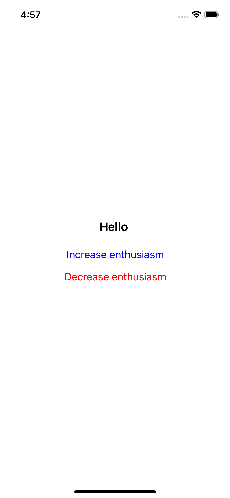
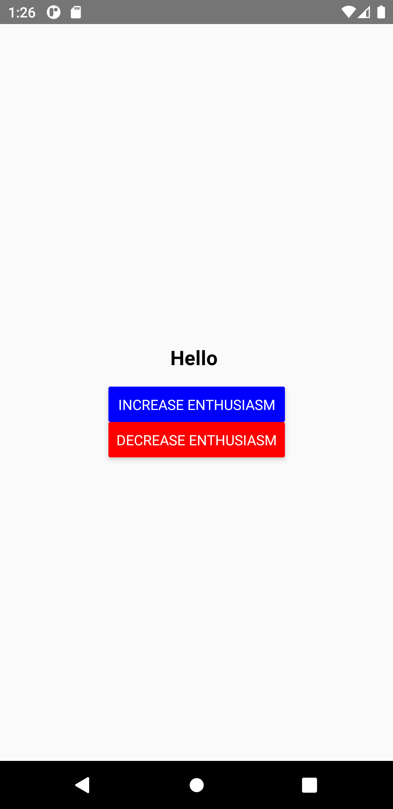

# circleci-reactnative-detox-demo

 

Demo for CI/CD pipeline for React Native + Detox app using CircleCI.
* [React Native](https://reactnative.dev/)
* [Detox](https://github.com/wix/Detox)

# Features
* All config as code
  * [CircleCI config file](https://github.com/tadashi0713/circleci-reactnative-detox-demo/blob/master/.circleci/config.yml)
* Use `circleci/node` orb to run unit-test(Jest) + lint(ESLint)
  * [Node orb](https://circleci.com/developer/orbs/orb/circleci/node)
* Detox
  * [Example test](https://github.com/tadashi0713/circleci-reactnative-detox-demo/blob/master/e2e/example.e2e.js)
  * iOS simulator on CircleCI macos machine
    * https://circleci.com/docs/2.0/testing-ios/
  * Android emulator on CircleCI Android machine
    * https://circleci.com/docs/2.0/android-machine-image/
* Build & distribute app to Firebase App Distribution using Fastlane(Only android)
  * [Fastfile](https://github.com/tadashi0713/circleci-reactnative-detox-demo/blob/master/android/fastlane/Fastfile)
